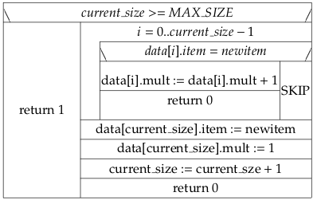

# Imperatív programozás (BSc, 18) zh programozási feladat

Ebben a feladatban egész számokat gazdaságosan tároló rendszert fogunk
készíteni. Minden számot csak egyszer tárolunk, és még nyilvántartjuk,
hogy az adott egész számból hány darab szerepel az adatbázisban
(multiplicitás). Például, `(2, 5)` jelentse azt, hogy az 2-es számból 5
példány van tárolva.

## Alapfeladat (13 pont)

Az első megoldásban definiáljon `MAX_SIZE` néven egy előfeldolgozói
szimbólumot, amely az adatbázisban tárolható számok felső korlátját
jelenti. Hozzon létre `item_t` néven egy struktúra típust, amelyben
tárolhatunk egy előjeles egész számot `(item)` és egy másik, előjel
nélküli egész számot `(mult)`; ez utóbbi a multiplicitást fogja
jelenteni. Az `item_t x;` egy érvényes deklaráció legyen.

Az első megoldásban az adatokat egy globális `data[]` tömbben kell
tárolni, amelynek típusa `item_t`, mérete `MAX_SIZE`, valamint legyen
egy `current_size` globális változó, amelyben az tároljuk, hogy éppen
hány elemet tárolunk az adatbázisban.

Valósítsa meg az `add(newitem)` függvényt, amely paraméterként egy
előjeles egész számot fogad és szintén egy előjeles egész számmal tér
vissza. A függvény tárolja az adatbázisban a paraméterként kapott egész
számot, vagy ha a tárolás nem lehetséges (például mert az adatbázis tele
van), akkor térjen vissza 1-es értékkel, sikeres működés esetén 0-ás
értékkel. Az `add(newitem)` függvény a következő struktogram szerint
működjön:

Készítsen egy `PrintAllItems()` függvényt, amellyel (szám,
multiplicitás) alakban kiírja a képernyőre az összes adatbázisban tárolt
egész számot és annak multiplicitását. A függvény nem fogad
paramétereket és nem tér vissza értékkel.

Készítsen `init()` néven függvényt, amelyben a `current_size` globális
változó értékét 0-ra állítja.

Készítsen főprogramot, amelyben bemutatja az `init()`, `add()` és
`PrintAllItems()` függvények használatát. Az adatbázisban tároljon
számokat 1, valamint 1-nél nagyobb multiplicitással is.

## Modularizáció (5 pont)

Bontsa fordítási egységekre programját. Az adatbázis rendszer (a
globális változók és az adatbázist kezelő függvények) kerüljenek külön
fordítási egységbe, valamint készüljön el egy header állomány az
adatbázis kezelő rendszerhez. A header fájlt lássa el include
guard-okkal, valamint oldja meg, hogy az adatbázist jelentő globális
változók ne látszódjanak ki a generált fájlból (csak az adatbázis
fordítási egységében legyenek elérhetőek).

## Dinamikus memóriakezelés (12 pont)

Ebben a feladatban átalakítjuk az eddigi megoldást úgy, hogy a
függvények nem globális változókat módosítanak, hanem készítünk egy
újabb `struct` típust, amelynek mezői töltik be az eddigi globális
változók szerepét, és a függények paraméterként kapnak ilyen `struct`
típusú példányokat, amelyeken operálnak.

Szabaduljunk meg a `data[]` és `current_size` globális változóktól és a
`MAX_SIZE` szimbólumtól. Készítsünk egy újabb `struct` típust az
`item_t` mellé, amelynek a neve legyen `Bag`, és három mezője legyen:

`data`, `item_t` típusú adatra mutató pointer

`current_size`, előjel nélküli egész

`max_size`, előjel nélküli egész

A `data` által mutatott területen `item_t` típusú adatokat fogunk
tárolni, amelyet pointeraritmetikával vagy tömbindexeléssel érhetünk el
(struktúra a struktúrában).

\[Segítség: Például, ha a `bag1` változó `Bag` típusú, akkor a
`bag1.data` hivatkozás `item_t*` típusú eredményt ad, amely `item_t`
struktúra pointer-e. `bag1.data[i]` az i-edik `item_t` példányt adja
eredményül, amelynek például a `mult` mezőjére így hivatkozhatunk:
`bag1.data[i].mult`, ahol `0 <= i` és `i < current_size`\]

`current_size` jelenti a tárolt `item_t` típusú adatok számát, a
`max_size` pedig az eddigi `MAX_SIZE` szimbúlum szerepét veszi át: azt
jelenti, a `Bag` példányban legfeljebb hány `item_t` típusú adatot
tárolhatunk.

Módosítsa az `init()`, `add()`, `PrintAllItems()` függvényeket úgy,
paraméterként fogadjanak `Bag` vagy `Bag*` típusú adatot. Az `init()` és
`add()` módosítani is fogják ezt a paramétert! Az `init()` függvénynek
legyen továbbá egy `max_size` paramétere, amelyet írjon be a `Bag`
paraméter `max_size` mezőjébe, ezenkívül foglaljon le `max_size`
darab `item_t` típusú elemnek helyet a heap-en, a lefoglalt tárterület
első elemére mutató pointer-t tárolja a `data` mezőben.

Az `init()` függvény 1-es visszatérési értékkel jelezze, ha a
memóriafoglalás sikertelen volt, sikeres működés esetén 0-val térjen
vissza.

Módosítsa a főprogramot a megváltozott paraméterezésnek megfelelően.

A program ne leak-elje a memóriát! Készítsen egy `finalize()` függvényt,
amely hasonlóan egy `Bag` típusú adatot fogad, és felszabadítja a
korábban lefoglalt dinamikus memóriaterületet, valamint a `current_size`
és `max_size` mezőket 0-ra állítja.

