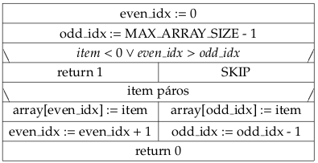

# Imperatív programozás (BSc, 18) zh programozási feladat

Ebben a feladatban megvalósítunk egy “paritásos tömb” típust: egészek
olyan tömbje, ahol a páros számok a tömb elején, a páratlan számok a
tömb végén helyezkednek el.

Legyen például a tömb mérete 5. Kezdetben a tömb üres: \_ \_ \_ \_ \_

A 2 hozzáadása után: 2 \_ \_ \_ \_

A 7 hozzáadása után: 2 \_ \_ \_ 7

Az 1 hozzáadása után: 2 \_ \_ 1 7

A 9 hozzáadása után: 2 \_ 9 1 7

A 4 hozzáadása után: 2 4 9 1 7

## Alapfeladat (9 pont)

Definiáljon `MAX_ARRAY_SIZE` néven egy preprocesszor szimbólumot, amely
szimbólumot használjuk a tömb maximális méretére hivatkozáskor
(beégetett értékek helyett).

Írjon `InsertToParityArray()` néven függvényt, amely paraméterként
előjeles egészek tömbjét és a beszúrandó elemet (előjeles egész szám)
kap paraméterként. Az első megoldás bár előjeles egészeket fogad, csak
nemnegatív egész számok tárolására alkalmas, mert a tömbbeli üres
helyeket (\_) a -1-gyes értékkel fogjuk reprezentálni (a feladatsor
végén ezt a megszorítást is feloldjuk). A függvény egy `even_idx` és
`odd_idx` változókban tárolja, hogy páros illetve páratlan beszúrandó
elem esetén mi a következő szabad index a tömbben. Például, ha a tömb
2 \_ \_ 1 7, akkor `even_idx=1` és `odd_idx=2`. Az `even_idx` és
`odd_idx` legyenek olyan lokális változói az `InsertToParityArray()`
függvénynek, amelyek a függvényhívások között is megőrzik értéküket (ha
ezt nem tudja megoldani, akkor legyenek globális változók, amelyek
inicializálása ne a függvény törzsében történjen meg). Sikeres beszúrás
esetén 0, sikertelen beszúrás esetén 1 a függvény visszatérési értéke.

Az `InsertToParityArray(array, item)` függvény struktogramja:

Készítsen `PrintParityArray()` néven függvényt, amely kiírja a
képernyőre a tömb elemeit. Az üres helyeket a -1-gyes értékkel
reprezentáljuk, a -1-gyes tömbelemek ne kerüljenek kiírásra (üres hely
esetén ne kerüljön semmi a képernyőre).

Készítsen főprogramot, amelyben definiál egy tömböt, amelynek minden
elemét kezdetben -1-re inicializáljuk. Adjon hozzá páros és páratlan
számokat a tömbhöz az `InsertToParityArray()` függvénnyel, majd a
`PrintParityArray()` függvénnyel írassa ki a képernyőre legalább kétszer
a tömb tartalmát: egyszer amikor tele van és egyszer amikor vannak üres
helyek is a tömbben. Itt **nem** szükséges a standard input-ról olvasni,
elegendő "beégetett" példákkal meghívni a függvényeket.

## Modularizálás (3 pont)

Bontsa fordítási egységekre programját. A függvény implementációk
kerüljenek külön fordítási egységbe, amelyhez készüljön el egy header
állomány. A header állományt védje include guard-dal.

## ParityArray típus (9 pont)

Vezessünk be egy saját `ParityArray` típust, és a függvények ilyen
típusú paraméterek fogadásával dolgozzanak a továbbiakban.

A `ParityArray` egy struktúra, amelynek legyen egy `MAX_ARRAY_SIZE`
méretű, egészeket tartalmazó tömbje, valamint két mezője, `even_idx`
és `odd_idx` a páros illetve páratlan szám esetén a következő szabad index a
tömbben. A `ParityArray` legyen típusnév is, tehát `ParityArray pa;` egy
érvényes változódeklarációnak számítson.

Módosítsa az `InsertToParityArray()` függvényt: `ParityArray` típusú
adatot fogad, és nincs már szükség az `InsertToParityArray()` függvény
`even_idx` és `odd_idx` lokális változóira, hiszen ezen adatokat a
struktúra példány ugyanilyen nevű mezőiben tároljuk.

Készítsen egy `InitParityArray()` nevű függvényt, amely a paraméterként
kapott `ParityArray` példányt inicializálja: a tömb minden elemét
beállítja üres helyre (-1), és az `even_idx` és `odd_idx` mezőket a
megfelelő kezdőértékkel inicializálja.

Hasonlóan végezze el a szükséges módosításokat a `PrintParityArray()`
függvény esetén is, azonban paraméterként úgy vegye át a `ParityArray`
példányt, hogy elkerülje annak lemásolását, mert potenciálisan egy
`ParityArray` nagyon nagy is lehet.

A megváltozott függvényparaméterezéshez illeszkedően módosítsa a
főprogramot is.

## Dinamikus memóriakezelés (9 pont)

Dobjuk ki a `MAX_ARRAY_SIZE` korlátozást a programból, helyette a
`ParityArray` típusban tároljuk egy előjel nélküli egész mezőben,
hogy az adott példány maximum hány elemet képes tárolni. Ezt az
mezőt az `InitParityArray()` függvény állítsa be egy új, a függvény
paramétereként megkapott méretre.

A tömb típusú struktúra mező helyett a függvények a heap-en tárolják az adatokat;
a típusban tömb helyett pointer-t tárolunk. A dinamikus memóriafoglalást
végezze az `InitParityArray()` függvény, amely 1-es visszatérési
értékkel jelezze, ha a memóriafoglalás sikertelen volt, 0-ás
visszatérési értékkel, ha sikeres volt.

Ebben a megoldásban már tetszőleges előjeles egész tárolását támogatnunk
kell. Ehhez törölje az `InsertToParityArray()` függvényből azt a részt,
amely negatív elem esetén a függvény terminálását idézte elő. Az
`InitParityArray()` függvényből törölje a memóriaterület minden elemének
-1-re való értékadását. A `PrintParityArray()` a továbbiakban tehát az
üres helyek felismeréséhez nem támaszkodhat arra, hogy az üres helyen -1
érték lenne; ennek megfelelően módosítsa a `PrintParityArray()`
függvényt úgy, hogy ugyanazt az eredményt lássuk, mint eddig (üres
helyek esetén nem ír ki semmit a képernyőre).

Készítsen `DisposeParityArray()` néven függvényt, amely a paraméterként
kapott `ParityArray` példányt alaphelyzetbe állítja: a mezőket 0-ra állítja,
az általa lefoglalt dinamikus memóriaterületet felszabadítja.

